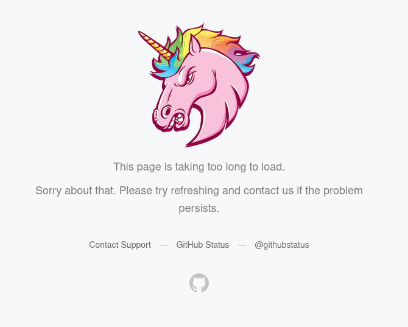

# Script to export your data from GitHub

You can export your GitHub account data in [your account settings](https://github.com/settings/admin). Unless you have too many repos in your account, in which case you will get a server error:



I talked with GitHub support about this issue, and apparently the only way to fix this is to use the [Migrations API](https://docs.github.com/en/rest/reference/migrations) (currently in preview) to request exports in 100 repo chunks. This has some scripts to do that.

## Usage

### Creating exports
```bash
# Create a personal access token at https://github.com/settings/tokens/new (not sure what permissions are needed, so just add them all)
# Include a leading space when entering the command to stop it from being saved in your .bash_history
$  export GH_TOKEN=...

$ ./startmig.sh 1 # repos 1-100
"https://api.github.com/user/migrations/..."
$ ./startmig.sh 2 # repos 101-200
"https://api.github.com/user/migrations/..."
# repeat until exports created for all repos
```
### Getting export data
Exports take time to process after being created. You will recieve an email when your they are ready. If you want to heavily automate the process, you can use `getmig.sh` and `checkmig` though.

```bash
# check status of export
./checkmig.sh "https://api.github.com/user/migrations/547612" # pending | exporting | exported | failed

# get export URI
./getmig.sh "https://api.github.com/user/migrations/547612"
```

If the migration status if `failed`, try changing the script to use a smaller chunk size and try again.
